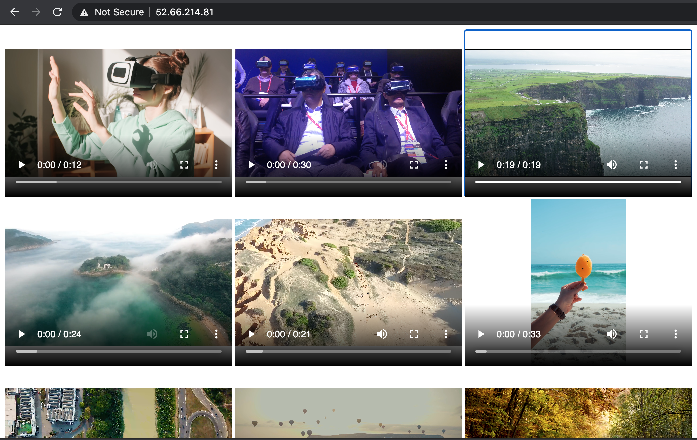

# video-gallery-s3-ec2
video gallery using html and js

# Steps to execute this project

# launch ec2 Ubuntu instance 

`sudo apt-get update`

`sudo apt-get install apache2`

replace content of  the existing index.html in /var/www/html dir with this index.html 

`sudo service apache2 restart`

# Find public ip of EC2 ubuntu instance

# Add security group to allow inbound traffic to port 80 from anywhere

# in browser just enter the public ip of ec2 ubuntu instance and hit enter

# you will be able to see the video dashboard  like below

